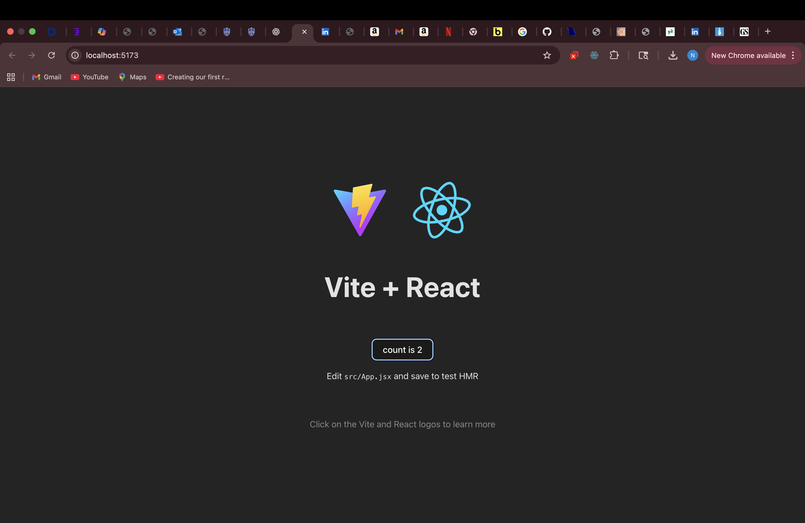
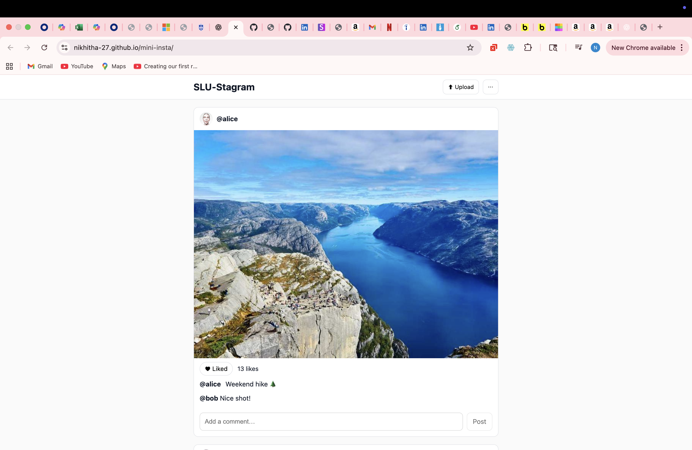
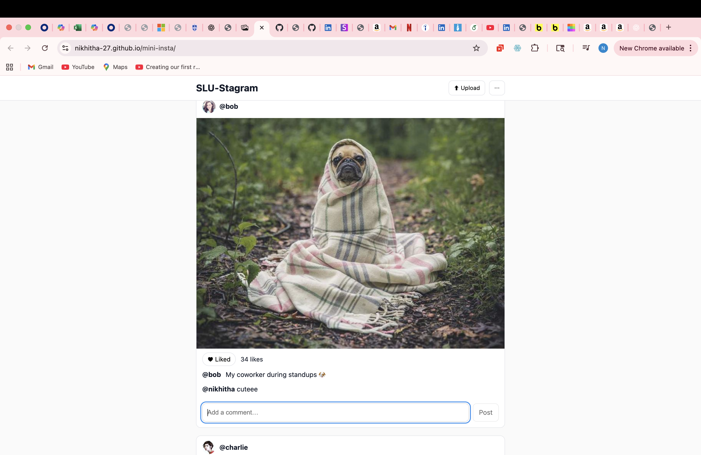
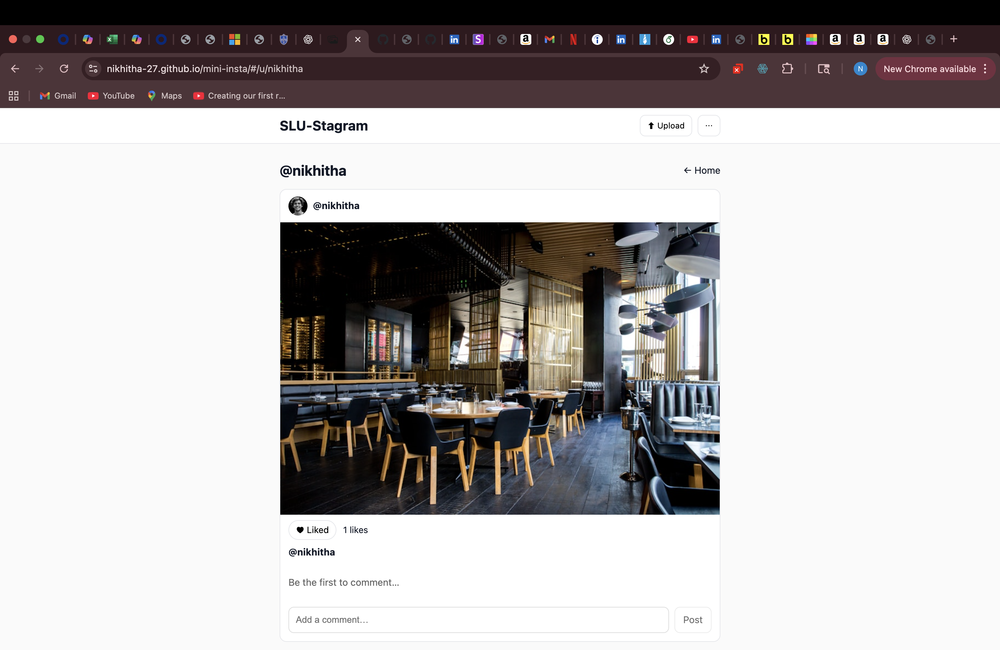
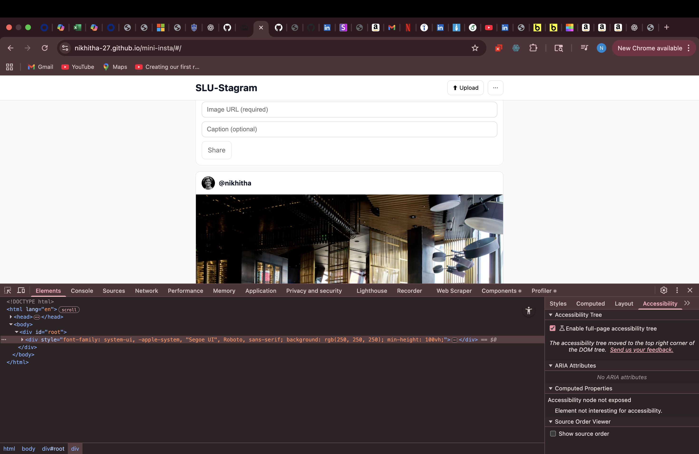
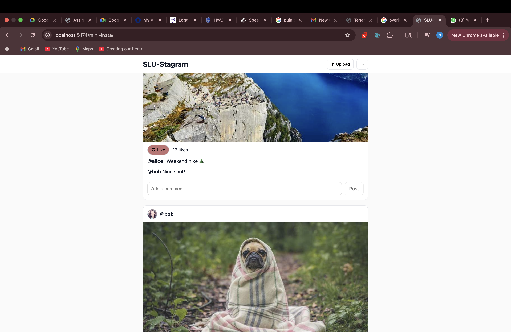
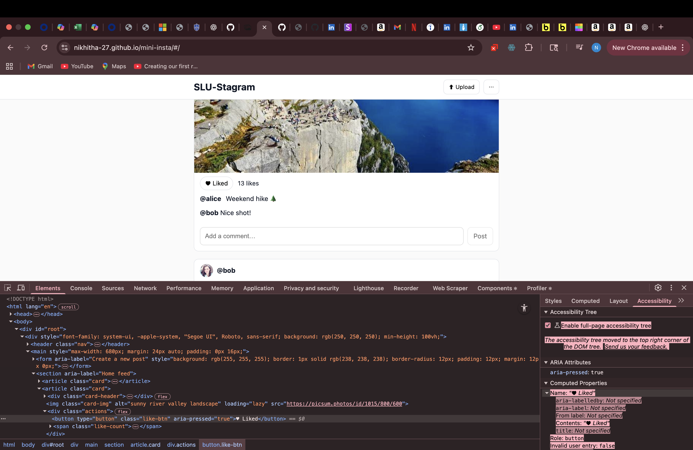

# SLU-Stagram (Mini Instagram Project)

**Name:** Nikhitha Mysolla  
**Course:** Web Development Lab 2 (Fall 2025)  
**Project:** Mini Insta App built with React + Vite

---

## 🌍 Live Demo
🔗 [https://nikhitha-27.github.io/mini-insta/](https://nikhitha-27.github.io/mini-insta/)  
📦 GitHub Repo: [https://github.com/Nikhitha-27/mini-insta](https://github.com/Nikhitha-27/mini-insta)

---

## 🖼️ Screenshots
| Feature | Screenshot |
|----------|-------------|
| Home feed |  |
| Like button working |  |
| Comment added |  |
| Creating a new post |  |
| Profile page |  |
|**Screenshot A** | App showing centered layout and DevTools Styles panel with system-ui font-family and `.main` container ||margin |  |
| **Screenshot B** | Hovered Like button showing hover style difference |  |
| **Screenshot C** | DevTools Elements view showing:<br>• a Like `<button>` with `aria-pressed="true"` (after clicking)<br>• a post image `` with a meaningful `alt` attribute |  |

---
Image URL: https://images.unsplash.com/photo-1517248135467-4c7edcad34c4?w=800&h=600
## 💡 About This Project
This is a small Instagram-style web app I built for my Web Development Lab assignment.  
I used **React** with **Vite** to make it fast and responsive.  
It lets users:
- View a feed of posts
- Like/unlike posts
- Add comments
- Create new posts with an image and caption
- Open profile pages by clicking author names
- Navigate using a top bar and a bottom tab bar (Home, Search, Reels, Profile)

I tried to make it look clean and close to the real Instagram design.

---

## ⚙️ How I Built It
- **Frontend:** React + Vite  
- **Routing:** React Router (using HashRouter for GitHub Pages)
- **Styling:** My own CSS for an Instagram-like layout  
- **Storage:** LocalStorage to save posts, likes, and comments even after refresh  
- **Hosting:** GitHub Pages  

---

## 🧩 Project Structure
src/
components/
Navbar.jsx
BottomNav.jsx
Composer.jsx
Feed.jsx
PostCard.jsx
CommentList.jsx
CommentForm.jsx
Profile.jsx
data/posts.js
App.jsx
main.jsx
index.css

---

## 🧠 What I Learned
- Setting up a React project using Vite  
- Passing data and state between components  
- Using LocalStorage to keep data after refresh  
- Creating routes for different pages  
- Designing a simple responsive layout similar to Instagram  
- Deploying a React app using GitHub Pages  

---

## 🧾 How to Run It
```bash
git clone https://github.com/Nikhitha-27/mini-insta.git
cd mini-insta
npm install
npm run dev
Then open http://localhost:5173
